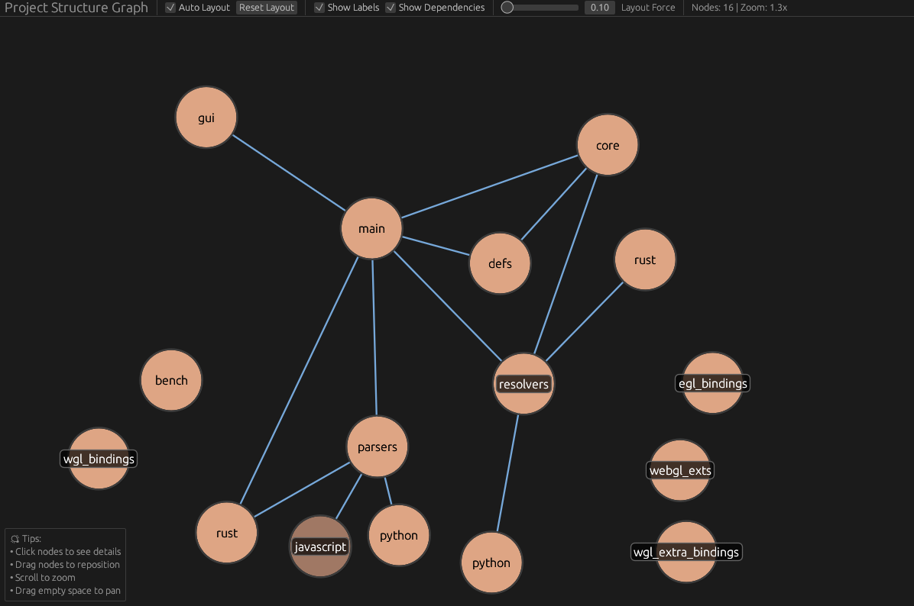

<h1 align="center">
  seiri (整理)
</h1>

<div align="center">
  <a href="https://github.com/tarolling/seiri/releases/latest">
    
  </a>
  <a href="https://github.com/tarolling/seiri/blob/main/LICENSE">
    
  </a>
  
  <a href="https://github.com/tarolling/seiri/actions/workflows/ci.yml">
    
  </a>
  <a href="https://discord.gg/UrS8hc5HTz">
    
  </a>
</div>

<h3 align="center">
  A platform-agnostic project visualization tool.
</h3>
<br>

<div align="center">
  
</div>

## Overview

seiri breaks down project structures into a common format that can be used by developers and AI alike to better understand the design of large codebases.

### Features

* Explores system structure and dependencies visually
* Extracts modules, imports, functions, and containers
* Uses [tree-sitter](https://github.com/tree-sitter/tree-sitter) for fast, incremental parsing

## Installation

You can find our pre-built binaries under the Releases tab to download.

If you want to build from source, clone the repository and make sure to install the Rust toolchain. Then you can run the following commands:

```sh
cargo build --release
./target/release/seiri <options>
```

## Usage

Provide a path to the project you want to analyze, and optionally specify to produce a visualization and/or an image file containing all extracted information.

```sh
seiri <path> [gui|<export_path>] [-v|--verbose]
```

* `<path>` - File or directory to analyze
* `gui` - Launch visualization
* `<export_path>` - Export graph to specified path; currently supports `SVG` and `PNG` file exports
* `-v`/`--verbose` - Show detailed logging about file detection and parsing
* `--no-gitignore` - Do not respect `.gitignore` file if present

## Supported Languages

* Rust
* Python
* TypeScript

## Contributing

Contributions are greatly appreciated! :)

Make sure to follow the guidelines laid out in [CONTRIBUTING.md](/.github/CONTRIBUTING.md).

## License

[MIT License](/LICENSE)
