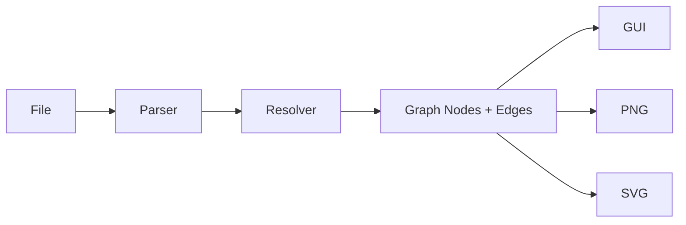

# Interfaces

Parser to graph builder:

- Imports
- Function definitions
- Function references
- Container definitions (classes, structs, etc.)
- Container references

## Nodes

### Import

|Field|Type|Description|
|-----|----|-----------|
|module|`str`|Name of module importing from|
|name|`str`|Name of module being imported|
|alias|`str`|Import alias of module|
|level|`int`|Relative level of import, with 0 being absolute import|

#### Example

```py
from functools import partial as par
```

is equivalent to

```py
{
  "module": "functools",
  "name": "partial
  "alias": "par",
  "level": 0
}
```



## Language-Specific Notes

### C++

seiri supports C++ projects with the following file extensions: .cpp, .cc, .cxx, .c++, .h, .hpp, .hxx, .h++.

**Include Resolution:**
- Local includes (\#include "file.h"\) are resolved relative to the including file and via configured include directories
- System includes (\#include <file.h>\) are recognized but filtered out from the dependency graph
- Support for common C++ standard library and third-party library includes (Boost, Qt, OpenGL, etc.)
- Conditional compilation directives (\#ifdef\, \#ifndef\, \#if\) are analyzed for completeness

**Known Limitations:**
- Macro expansion is limited to recognized patterns (e.g., \BOOST_INCLUDE\)
- Complex template instantiations are not fully analyzed
- Some advanced preprocessor directives may not be fully captured
